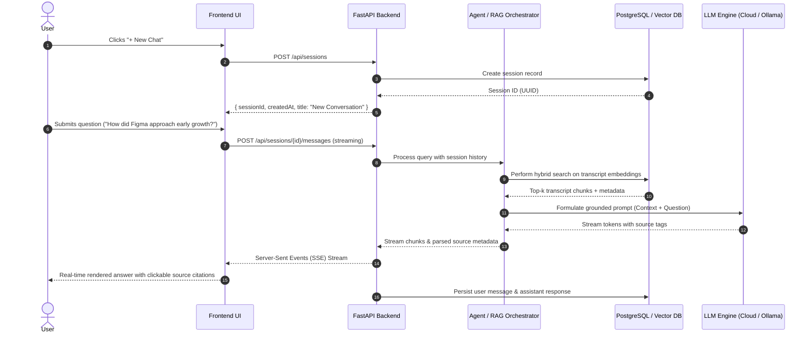
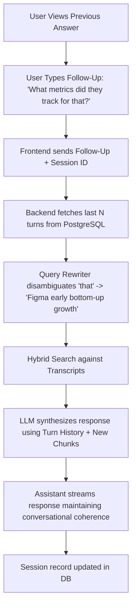
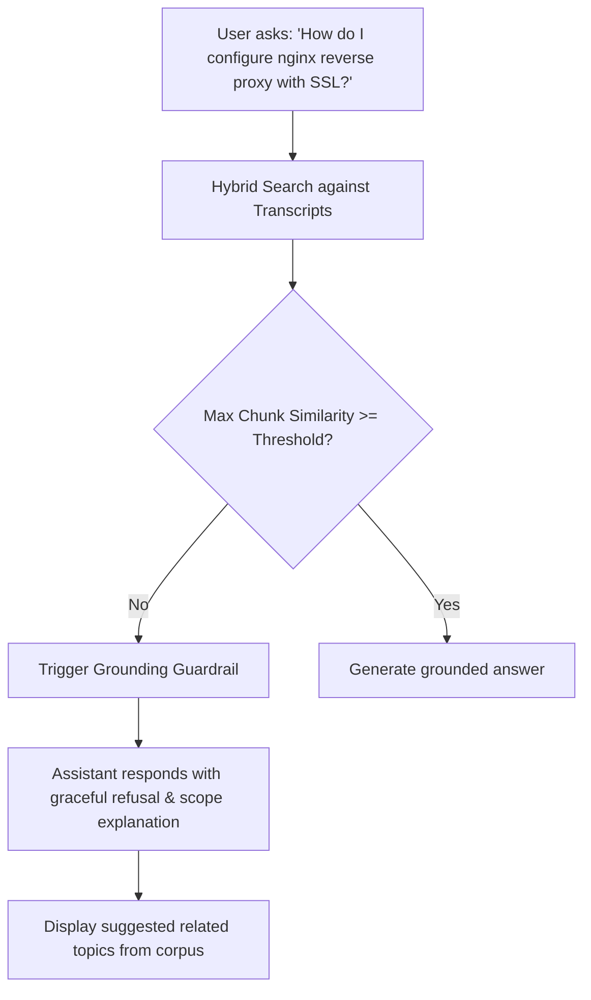
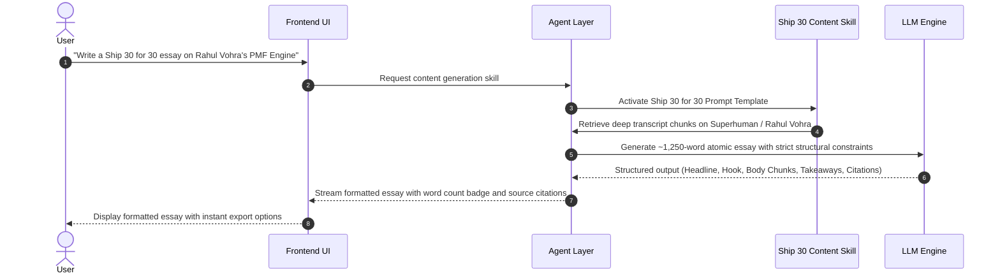
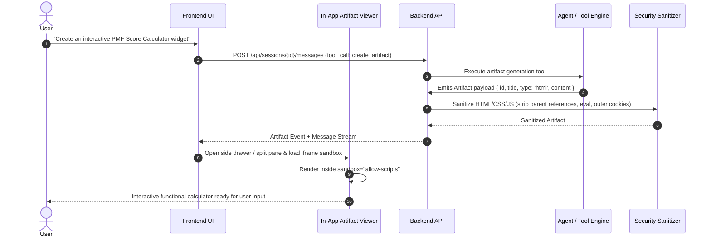

# The Lenny Growth Assistant — Product Requirements Document (PRD)

**Document Version:** 1.0.0  
**Status:** Approved for Architecture & Design (Phase 1 Complete)  
**Author:** Senior Forward Deployed Engineer & AI Systems Architect  
**Project:** The Lenny Growth Assistant  
**Target Delivery:** High-Reliability Full-Stack Agentic Web Application  

---

## 1. Executive Summary

Modern product and growth practitioners constantly seek authoritative, battle-tested wisdom from world-class operators to make high-stakes product decisions, craft growth strategies, and produce actionable artifacts. *Lenny's Podcast* represents one of the tech industry's richest repositories of tactical product and growth expertise, featuring hundreds of deep-dive interviews with leading operators, founders, and growth leaders.

However, accessing and applying this institutional knowledge in daily workflows remains severely bottlenecked: transcripts are unstructured, lengthy, difficult to search semantically, and disconnected from the tools where work happens. 

**The Lenny Growth Assistant** is a full-stack, AI-powered conversational application designed to transform raw podcast transcript data into a reliable, grounded internal growth advisor. The application enables users to:
1. Conduct multi-turn, grounded conversational inquiries backed by verbatim transcript source citations and clear attribution.
2. Transform retrieved tactical wisdom into high-impact, ~1,250-word essays formatted according to proven digital writing principles (*Ship 30 for 30* style).
3. Automatically synthesize product frameworks, growth calculators, templates, and roadmaps into interactive Markdown and sandboxed HTML/CSS artifacts.
4. Preview and interact with generated artifacts side-by-side in a secure, sandboxed in-app Artifact Viewer.
5. Operate seamlessly across both local offline environments (via Ollama) and production cloud environments (via Anthropic Claude / OpenAI / Cloud LLMs) with persistent session history backed by PostgreSQL.

This PRD establishes the product specifications, system boundaries, user journeys, functional and non-functional requirements, safety constraints, testable acceptance criteria, and technical trade-offs for the implementation.

---

## 2. Discovery Brief

### 2.1 User Personas

#### Primary User: The Product & Growth Practitioner
* **Profiles:** Product Managers (APM to VP of Product), Growth Marketers, Growth Engineers, and Early-Stage Founders.
* **Technical Profile:** Non-expert in AI mechanics; does not understand (and should not need to care about) prompt engineering, context windows, vector embeddings, chunking strategies, or model parameters.
* **Context & Environment:** Fast-paced startup and scale-up environments. They need actionable answers to tactical questions (e.g., "How did Figma structure their early bottom-up pricing?", "What metrics should we track for B2B freemium retention?", "How do we run high-velocity growth experiments?").

#### Secondary User: The Content & Knowledge Lead
* **Profiles:** Product Marketing Managers (PMMs), Founders writing internal/external playbooks, Team Leads onboarding junior PMs.
* **Needs:** Needs to synthesize sprawling discussions into structured playbooks, atomic essays, executive summaries, and visual growth models for team distribution.

### 2.2 Problem Statement

> **Users need to** rapidly extract verified, actionable product and growth advice from hundreds of hours of *Lenny's Podcast* interviews, **but today they must** manually search keyword transcripts, listen to hours of audio, or use generic LLMs prone to hallucination, **which causes** wasted hours, vague non-actionable advice, lack of verifiable source attribution, and lost organizational velocity.

#### Current Workflow Breakdown & Friction
1. **Keyword Query Friction:** Traditional search tools (Ctrl+F, YouTube search, simple text matching) fail on conceptual queries like "how to decide between sales-led vs. product-led growth" if exact terminology is not used.
2. **Generic LLM Hallucination:** Using public consumer chatbots (e.g., stock ChatGPT) yields generic, unverified product advice that attributes fabricated quotes to podcast guests or invents frameworks not supported by the actual guests.
3. **Synthesis Overhead:** Even after finding relevant knowledge, manually synthesizing takeaways into crisp frameworks, atomic essays, or visual UI artifacts takes 3–5 hours per topic.
4. **Context Loss:** Existing tools do not maintain session-level conversational context alongside dedicated artifact workspaces.

### 2.3 Jobs-to-be-Done (JTBD)

| When I am... | I want to... | So that I can... |
| :--- | :--- | :--- |
| Confronted with a strategic product or growth dilemma | Ask conversational questions and get answers synthesized directly from expert podcast guests | Make informed product decisions grounded in verified real-world experience without listening to 50+ hours of audio. |
| Reviewing advice provided by the assistant | Inspect exact source attribution (guest name, episode title, timestamp/context) | Verify the credibility of the insight and cite the source in internal strategy documents. |
| Exploring a nuanced topic in depth | Ask iterative follow-up questions that build upon previous context | Deepen my understanding without repeating constraints or re-explaining the problem. |
| Preparing an internal strategy doc or team guide | Transform grounded transcript insights into a structured ~1,250-word atomic essay (*Ship 30 for 30* style) | Share digestible, persuasive, high-impact growth frameworks with my team and stakeholders. |
| Designing a growth funnel, calculation tool, or workflow | Automatically generate functional Markdown tables or interactive HTML/CSS widgets | Directly inspect, test, and render the output side-by-side in real-time within my workspace. |
| Inquiring about a topic absent from the corpus | Receive an explicit, honest disclosure of lack of information rather than fabricated advice | Trust that the assistant will never invent data or mislead my team. |

### 2.4 Success Metrics

#### Product & Quality Metrics

| Metric | Target | Rationale & Measurement Methodology |
| :--- | :--- | :--- |
| **Grounded Answer Accuracy** | $\ge 95\%$ | The proportion of factual claims in generated responses directly substantiated by retrieved transcript chunks. Evaluated via automated RAG triaging and manual gold-standard evaluation sets. |
| **Source Attribution Rate** | $100\%$ | Every factual claim or quote derived from the podcast corpus must cite the specific episode title, guest name, and segment context. |
| **Hallucination Rate** | $\le 2\%$ | The percentage of responses containing fabricated guests, metrics, or frameworks. Hard constraint: System must refuse to answer when corpus support is below confidence thresholds. |
| **Refusal Precision on Unsupported Queries** | $\ge 98\%$ | System reliably identifies queries out of corpus domain (e.g., "How do I fix a Kubernetes DNS error?") and declines gracefully without fabricating answers. |
| **Artifact Generation & Render Success** | $\ge 98\%$ | Generated Markdown and HTML/CSS artifacts parse cleanly, pass automated sanitization, and render visually in the Artifact Viewer without crashing the DOM. |
| **Session Continuity Rate** | $100\%$ | Multi-turn conversational context is maintained across turn boundaries within the same session and restored correctly across page reloads. |

#### Operational & Technical Metrics

| Metric | Target (Cloud) | Target (Local Ollama) | Measurement Methodology |
| :--- | :--- | :--- | :--- |
| **First Token Latency (TTFT)** | $< 1.5\text{s}$ | $< 4.0\text{s}$ | Time from user query submission to initial streaming token rendering. |
| **End-to-End Response Time** | $< 8.0\text{s}$ | $< 25.0\text{s}$ | Total time for complete conversational response generation. |
| **Retrieval Latency (RAG)** | $< 350\text{ms}$ | $< 600\text{ms}$ | Hybrid vector + keyword search retrieval and re-ranking time against PostgreSQL / pgvector. |
| **API Error Rate** | $< 0.5\%$ | $< 1.0\%$ | Rate of $5\text{xx}$ HTTP server errors over total requests. |
| **Sandbox Security Violations** | $0$ | $0$ | Zero instances of XSS payload escape, cookie exfiltration, or parent-window access from the Artifact Viewer. |

### 2.5 Deliberate Non-Goals & Product Rationale

Demonstrating strong product and engineering prioritization, the following capabilities were **intentionally excluded as deliberate non-goals**:

1. **General-Purpose Web Search or Arbitrary QA:**
   - *Rationale:* The assistant's core differentiator is authoritative, verifiable grounding in *Lenny's Podcast* wisdom. Allowing unbounded web searching degrades trust and introduces hallucination risks. When a topic is outside the podcast corpus, the system deterministically refuses rather than guessing.
2. **Audio Streaming or Voice Transcription Generation:**
   - *Rationale:* Real-time audio generation introduces substantial latency and infrastructure overhead without improving the core JTBD of rapid strategic learning and content synthesis. Text-based interaction with visual artifacts delivers $10\times$ faster information throughput for product practitioners.
3. **Complex Multi-Agent Swarms with Autonomous Tool Loops:**
   - *Rationale:* Unbounded autonomous agent loops introduce non-deterministic latencies, cost runaway, and unpredictable failure cascades. We prioritize a deterministic, tool-augmented router with specialized, bounded skills (Grounded Q&A, Ship 30 for 30, Artifact Builder) that execute predictably with sub-second orchestration overhead.
4. **Third-Party SaaS Integrations (Jira, Notion, Slack sync):**
   - *Rationale:* The primary objective is establishing an unassailable core of grounded retrieval, editorial synthesis, and secure artifact rendering. Adding external SaaS webhooks introduces deployment friction without advancing core product evaluation. Instead, easy Markdown export and one-click copy provide zero-friction interoperability.

---

## 3. Product Overview

**The Lenny Growth Assistant** is an enterprise-grade, agent-driven conversational workspace tailored for growth and product teams. It unites high-precision Retrieval-Augmented Generation (RAG), dynamic multi-model orchestration, specialized writing skills, and an interactive side-by-side Artifact Studio into a cohesive single-page web experience.

```
+------------------------------------------------------------------------------------+
|                                THE LENNY GROWTH ASSISTANT                          |
+----------------------+-----------------------------------+-------------------------+
| SESSIONS / HISTORY   | CHAT & GROUNDED REASONING         | ARTIFACT VIEWER         |
|                      |                                   |                         |
| + New Conversation   | [User]: How did Superhuman find   | +---------------------+ |
|                      |         product-market fit?       | | SUPERHUMAN PMF      | |
| - Retention Tactics  |                                   | | ENGINE (HTML/JS)    | |
| - B2B Pricing        | [Lenny Assistant]: Rahul Vohra    | |                     | |
| - PLG vs Sales-Led   | described the PMF Engine...       | | [ Interactive PMF   | |
|                      |                                   | |   Score Calculator  | |
|                      | Sources:                          | |   40% Very Disap.]  | |
|                      | [1] Rahul Vohra on Finding PMF    | |                     | |
|                      |                                   | +---------------------+ |
|                      | [Action]: "Generate PMF Calculator| [Raw] [Rendered] [Copy] |
|                      |  Artifact"                        |                         |
+----------------------+-----------------------------------+-------------------------+
```

The system operates on three foundational pillars:
1. **Verifiable Truth & Strict Grounding:** The assistant treats Lenny's podcast transcript corpus as its canonical knowledge boundary. Answers are synthesized strictly from retrieved evidence with full source citations. When evidence is insufficient, the system gracefully declines rather than fabricating answers.
2. **Specialized Agentic Skills:** Beyond conversational Q&A, the assistant possesses dedicated workflow skills: generating 1,250-word atomic essays adhering to the *Ship 30 for 30* framework, and generating structured artifacts (Markdown frameworks, HTML/CSS interactive calculators, visual process maps).
3. **Bimodal Deployment Architecture:** Designed to run reliably in both cloud production environments (using Claude 3.5 Sonnet / OpenAI GPT-4o) and zero-cost, fully local, offline environments (using Ollama with `llama3.1:8b` or `qwen2.5:7b`), backed by PostgreSQL for persistence.

---

## 4. Core Capabilities

### Capability A — Grounded Conversational Assistant
* **Context-Aware Multi-Turn Dialog:** Maintains conversation history and context within a session, enabling deep exploratory Q&A and iterative refinement.
* **Hybrid Semantic & Keyword Retrieval:** Queries chunked and indexed podcast transcripts using dense vector similarity combined with exact term matching (e.g., guest names, company names).
* **Verifiable Source Attribution:** Every factual statement is backed by inspectable source cards indicating the episode title, guest speaker, topic segment, and relevance score.
* **Explicit Failure Handling & Refusal Mode:** If the user asks about topics absent from the corpus (or questions unrelated to product/growth), the assistant explicitly communicates that the knowledge base lacks sufficient data, preventing hallucinations.

### Capability B — Ship 30 for 30 Content Skill
* **Structured Long-Form Synthesis:** Transforms retrieved insights into a publication-ready, ~1,250-word atomic essay.
* **Methodology Adherence:** Follows core *Ship 30 for 30* writing principles:
  * **One Clear Idea:** Focuses entirely on a single core product/growth thesis.
  * **Irresistible Headline & Lead-in Hook:** Uses clear, curiosity-inducing headlines and single-sentence hooks.
  * **Structured Rhythm & Readability:** Employs short paragraphs (1–3 sentences), bold key phrases, bulleted frameworks, and eliminates corporate fluff.
  * **Actionable Takeaways:** Concludes with immediately applicable implementation steps for the reader.
* **Full Grounding:** Even in creative long-form synthesis, every framework, metric, and case study is anchored directly in podcast transcript data with inline citations.

### Capability C — Dynamic Artifact Generation
* **Multi-Format Synthesis:** Generates self-contained, high-value digital artifacts based on conversation context:
  * **Markdown Artifacts:** Strategy memos, prioritization matrices (RICE/ICE), comparison tables, onboarding teardowns, and interview rubrics.
  * **HTML/CSS/JS Artifacts:** Interactive growth calculators, conversion funnel simulators, viral loop visualizers, roadmap timelines, and executive dashboards.
* **Structural Isolation:** Output is generated as discrete, versioned artifact objects with unique identifiers, title metadata, and format specifications.

### Capability D — In-App Artifact Viewer
* **Split-Screen Workspace:** Artifacts appear alongside the conversation pane in a dedicated viewer, eliminating the friction of scrolling past long code blocks in chat.
* **Multi-View Modes:** Supports toggling between **Rendered Interactive View**, **Source Code View**, and **Markdown Preview**.
* **Sandboxed Security Model:** All HTML/JS artifacts execute within a secure, isolated `<iframe>` sandbox (`sandbox="allow-scripts"` without `allow-same-origin`), preventing DOM tampering, XSS injection, cookie exfiltration, or parent-window access.
* **Export & Action Tools:** One-click copy, download raw file, and re-prompting the assistant to iterate on the artifact.

---

## 5. User Flows & State Transitions

### Flow 1: New Conversation & Grounded Q&A



* **System Action:** Initializes session, retrieves relevant transcript chunks using hybrid search, constructs a strictly bounded prompt, streams response, parses source references, persists conversation turn.
* **Expected Result:** User receives a clean, accurate answer within seconds, citing specific guests (e.g., Dylan Field, Amanda Kleha) and episode titles.
* **Failure State Handling:** If no transcript chunks exceed the relevance threshold ($\text{similarity} < 0.65$), the system triggers the refusal prompt: *"I could not find relevant discussions in Lenny's Podcast transcripts regarding this topic. The available library focuses on product strategy, growth loops, and hiring."*

---

### Flow 2: Multi-Turn Follow-Up with Context Retention



* **User Action:** Submits a pronoun-heavy or contextual follow-up (e.g., "What were the main objections to that strategy?").
* **System Action:** Loads conversation memory from PostgreSQL, re-contextualizes the query, retrieves complementary transcript evidence, and generates a seamless continuation.
* **Expected Result:** The assistant correctly resolves antecedents and provides a focused follow-up without losing previous discussion context.
* **Failure State Handling:** If conversational context exceeds token limits, the memory manager compresses earlier turns while preserving key entities and system instructions.

---

### Flow 3: Unsupported / Out-of-Domain Question (Refusal Mode)



* **User Action:** Asks a question unrelated to the podcast knowledge base (technical devops, unrelated domain, or fabricated guest).
* **System Action:** Vector search yields similarity below threshold ($\text{score} < 0.65$). The agent short-circuits to refusal mode without invoking speculative LLM knowledge.
* **Expected Result:** Clear, polite explanation of knowledge boundary with suggestions for valid product/growth queries.
* **Failure State Handling:** Under no circumstances does the system fabricate an answer or quote non-existent podcast episodes.

---

### Flow 4: Ship 30 for 30 Content Generation



* **User Action:** Requests an essay, thought piece, or atomic guide based on a topic or guest framework.
* **System Action:** Ingests retrieved transcript knowledge into the specialized *Ship 30 for 30* prompt template enforcing headline craft, short paragraph cadence, bolding patterns, modular sections, and an approximate target of 1,250 words.
* **Expected Result:** A crisp, engaging, publication-ready growth essay grounded entirely in verified transcript facts.
* **Failure State Handling:** If generated content is truncated by model max token limits, the system automatically requests a seamless continuation before presenting the completed artifact.

---

### Flow 5: Artifact Generation & In-App Rendering



* **User Action:** Asks for a calculator, spreadsheet-like matrix, or dashboard.
* **System Action:** Model invokes the `create_artifact` tool, emitting structured artifact metadata and code; backend sanitizes code; frontend automatically opens the Artifact Viewer in split-screen mode and renders the content in a secure `<iframe>`.
* **Expected Result:** Side-by-side view with chat on the left and live, interactive, styled artifact on the right.
* **Failure State Handling:** If HTML fails parsing or contains malicious scripts, the sanitizer rejects execution and falls back to safe syntax-highlighted code display with an alert message.

---

## 6. Functional Requirements

### 6.1 Conversation & Chat Management
* **`PR-001`**: The system shall provide a multi-turn chat interface capable of streaming responses in real time using Server-Sent Events (SSE).
* **`PR-002`**: The system shall support rich Markdown formatting in assistant responses, including headers, tables, bold text, code blocks, and blockquotes.
* **`PR-003`**: The system shall allow users to stop/cancel active response generation mid-stream.
* **`PR-004`**: The system shall maintain conversation context across up to 20 conversation turns per session without degradation of system instructions.

### 6.2 Session Management & Persistence
* **`PR-005`**: The system shall automatically persist all sessions, messages, and generated artifacts to a PostgreSQL database.
* **`PR-006`**: The system shall allow users to create new sessions, list historical sessions, switch between sessions, rename session titles, and delete sessions.
* **`PR-007`**: Switching between sessions shall instantly restore the full message history and associated artifacts in the Artifact Viewer.
* **`PR-008`**: The system shall generate an automatic, concise session title derived from the first user query.

### 6.3 Grounded Knowledge & Retrieval (RAG)
* **`PR-009`**: The system shall chunk, embed, and index transcripts from *Lenny's Podcast* into a searchable vector and full-text index in PostgreSQL.
* **`PR-010`**: The retrieval pipeline shall perform hybrid search (dense semantic similarity + sparse keyword matching) to retrieve the top $K$ ($K=5\text{ to }8$) most relevant transcript chunks.
* **`PR-011`**: The assistant shall strictly constrain its factual answers to the retrieved transcript chunks and explicitly cite every source with guest name, episode title, and timestamp context.
* **`PR-012`**: The system shall trigger an explicit refusal response whenever the maximum retrieval similarity score is below the confidence threshold ($\tau = 0.65$), preventing hallucinations.

### 6.4 Content Generation (Ship 30 for 30 Skill)
* **`PR-013`**: The system shall incorporate a specialized *Ship 30 for 30* writing engine activated via user prompt or explicit UI action.
* **`PR-014`**: The generated essay shall target approximately 1,250 words and adhere to the structural principles: single core thesis, strong hook, short readable paragraphs (1–3 sentences), bold takeaways, bullet points, and actionable conclusions.
* **`PR-015`**: The content generator shall preserve source grounding, embedding factual claims from podcast guests directly into the essay structure.

### 6.5 Artifact Generation & Management
* **`PR-016`**: The agent layer shall support dynamic artifact generation via structured tool-calling / artifact tags (`create_artifact`), outputting:
  * Artifact Identifier (`UUID`)
  * Title (`string`)
  * Type (`markdown` | `html` | `svg`)
  * Content (`string`)
* **`PR-017`**: The system shall support multi-artifact generation within a single session, allowing users to browse previously generated artifacts via a session artifact history tray.
* **`PR-018`**: The system shall allow users to prompt the assistant to revise, edit, or extend an existing artifact, maintaining version history for that artifact.

### 6.6 Artifact Viewer
* **`PR-019`**: The UI shall feature a responsive side-by-side layout (or collapsible split pane) where the Artifact Viewer opens automatically upon artifact generation.
* **`PR-020`**: The Artifact Viewer shall support multiple tab views:
  * **Preview View:** Sandboxed interactive rendering for HTML/CSS/JS and formatted rendering for Markdown.
  * **Code View:** Syntax-highlighted raw source code view with line numbers.
* **`PR-021`**: The Artifact Viewer shall provide utility actions: Copy to Clipboard, Download as File (`.html` or `.md`), and Pop-out / Fullscreen toggle.
* **`PR-022`**: The Artifact Viewer shall isolate HTML/JS rendering inside an `<iframe>` configured with `sandbox="allow-scripts"`, preventing access to `window.parent`, localStorage, session cookies, or parent network state.

### 6.7 Model Configuration & Bimodal Support
* **`PR-023`**: The backend shall support pluggable model providers configurable via environment variables:
  * **Cloud Mode:** Anthropic Claude (via Claude Agent SDK / Anthropic API) or OpenAI GPT-4o.
  * **Local Mode:** Ollama running local open-weight models (e.g., `llama3.1:8b`, `qwen2.5:7b`, `mistral:7b`).
* **`PR-024`**: The application shall gracefully validate model connectivity on startup and provide descriptive diagnostic errors if an API key is missing or the local Ollama instance is unreachable.

### 6.8 Security & Input Sanitization
* **`PR-025`**: The backend shall sanitize all user input against prompt injection attempts and malicious payload structures.
* **`PR-026`**: The system shall run an HTML sanitizer on all generated HTML/JS artifacts prior to frontend delivery, stripping `<script>` tags that attempt parent communication (`window.top`, `document.cookie`, `fetch('/api/...')`).
* **`PR-027`**: Database queries shall utilize parameterized SQL and ORM queries exclusively, preventing SQL injection vulnerabilities.

---

## 7. Non-Functional Requirements (NFRs)

### 7.1 Performance & Latency
* **`NFR-001` (Streaming Latency):** Time to first streaming token (TTFT) shall be under 1.5 seconds for cloud models and under 4.0 seconds for local Ollama instances on standard consumer hardware (M-series Mac or 8-core x86 CPU with 16GB RAM).
* **`NFR-002` (Retrieval Latency):** Vector and hybrid transcript retrieval queries shall execute in under 350 milliseconds.
* **`NFR-003` (Artifact Render Time):** The in-app Artifact Viewer shall parse and mount generated artifacts in under 200 milliseconds after stream completion.

### 7.2 Reliability & Availability
* **`NFR-004` (Graceful Degradation):** If the primary cloud LLM provider experiences timeouts ($> 30\text{s}$) or rate limits ($429$), the backend shall return clean user-facing error notifications with retry recommendations.
* **`NFR-005` (State Durability):** Every completed message turn and generated artifact must be committed to PostgreSQL synchronously, ensuring zero data loss upon page refresh or server restart.

### 7.3 Portability & Reproducibility
* **`NFR-006` (Single-Command Launch):** The entire application stack (FastAPI backend, React/TypeScript frontend, PostgreSQL with pgvector, and ingestion pipelines) shall build and launch with a single `docker compose up --build` command.
* **`NFR-007` (Zero-Config Defaults):** The repository shall include a fully documented `.env.example` file with sensible defaults for local development.

### 7.4 Usability & Accessibility
* **`NFR-008` (Responsive Layout):** The UI shall support fluid desktop and laptop resolutions ($\ge 1280\text{px}$ width) with intuitive split-pane resizing between Chat and Artifact Viewer.
* **`NFR-009` (Visual Polish):** The interface shall follow modern design system principles: dark/light theme consistency, clean typography, unambiguous loading states, and intuitive source citation badges.

---

## 8. Testable Acceptance Criteria

### `AC-001`: Session Creation & Lifecycle
* **Given** a user navigates to the application,
* **When** they click "+ New Chat" or load the root URL for the first time,
* **Then** a new session is created with a unique UUID in PostgreSQL, the conversation history is empty, and the UI displays a clean welcoming prompt.

### `AC-002`: Grounded Transcript Q&A with Citation Inspection
* **Given** an active session,
* **When** the user asks: *"How did Lenny define the cold start problem for marketplaces?"*,
* **Then** the assistant streams an accurate response citing the relevant episode(s), renders clickable source badges listing guest name and episode title, and expanding the badge displays the exact transcript snippet used.

### `AC-003`: Multi-Turn Context Retention
* **Given** an ongoing conversation discussing Rahul Vohra's Product-Market Fit engine,
* **When** the user asks: *"What specific survey question did he recommend asking users?"*,
* **Then** the assistant correctly understands the antecedent ("he" = Rahul Vohra, "survey" = PMF survey) and answers with the 40% "very disappointed" question without requiring the user to restate the subject.

### `AC-004`: Out-of-Domain / Unsupported Query Refusal
* **Given** an active session,
* **When** the user asks: *"How do I configure a Kubernetes ingress controller with TLS certificates?"*,
* **Then** the system does not fabricate devops instructions; instead, it outputs an explicit message explaining that the question is outside the scope of *Lenny's Podcast* transcripts and suggests asking product/growth questions.

### `AC-005`: Ship 30 for 30 Long-Form Generation
* **Given** an active session,
* **When** the user prompts: *"Write a Ship 30 for 30 essay on finding product-market fit based on the podcast"*,
* **Then** the system outputs a formatted atomic essay between 1,000 and 1,400 words featuring a bold headline, 1-sentence hook, short paragraphs, bold callouts, actionable bullet points, and inline transcript citations.

### `AC-006`: HTML Artifact Generation & In-App Rendering
* **Given** an active session,
* **When** the user requests: *"Build an interactive PMF Score Calculator widget"*,
* **Then** the assistant generates a structured HTML/CSS/JS artifact, the Artifact Viewer pane automatically opens on the right, and the widget renders interactively within a sandboxed `<iframe>` allowing the user to click buttons and calculate scores.

### `AC-007`: Artifact Security Sandboxing
* **Given** a generated HTML artifact containing a simulated malicious script (`<script>window.parent.location = 'https://malicious.com'</script>`),
* **When** the artifact is rendered in the Artifact Viewer,
* **Then** the browser sandbox prevents execution of parent-window navigation, and the application state remains secure.

### `AC-008`: Bimodal Model Execution (Cloud & Ollama)
* **Given** `LLM_PROVIDER=ollama` and `OLLAMA_MODEL=llama3.1:8b` in `.env`,
* **When** the backend starts and the user submits a grounded query,
* **Then** the assistant executes retrieval against PostgreSQL, routes the prompt to the local Ollama daemon, and streams the response without cloud API keys.

---

## 9. Assumptions Matrix

| ID | Domain | Assumption Details | Status / Justification |
| :--- | :--- | :--- | :--- |
| **`ASM-001`** | **Deployment Target** | Internal productivity tool for product/growth teams, rather than an unauthenticated public consumer application. | Working assumption for the take-home implementation. |
| **`ASM-002`** | **Authentication Scope** | Session-based persistence without complex multi-tenant enterprise SSO (OAuth/SAML) for MVP. Individual browser sessions map to unique user UUIDs. | Working assumption for the take-home implementation to prioritize agent quality and core product experience. |
| **`ASM-003`** | **Transcript Corpus** | A representative dataset of cleaned *Lenny's Podcast* transcripts (JSON/Markdown format with guest, title, and timestamp metadata) is available for chunking and vector indexing. | Working assumption for the take-home implementation. |
| **`ASM-004`** | **Local Hardware Target** | Local demo environment assumes an 8-core CPU, 16GB RAM machine capable of running quantized 7B/8B parameter models via Ollama (e.g., `llama3.1:8b`, `qwen2.5:7b`). | Working assumption for the take-home implementation. |
| **`ASM-005`** | **Cloud Model Target** | Cloud provider defaults to Anthropic Claude 3.5 Sonnet / OpenAI GPT-4o for highest reasoning quality, tool calling, and long-form writing adherence. | Working assumption for the take-home implementation. |
| **`ASM-006`** | **Database Storage** | PostgreSQL with `pgvector` extension provides unified storage for relational session data, chat messages, artifact records, and vector embeddings. | Working assumption for the take-home implementation. |
| **`ASM-007`** | **Browser Support** | Modern evergreen browsers (Chrome, Firefox, Safari, Edge) supporting ES2022, CSS Grid, and `iframe[sandbox]`. | Working assumption for the take-home implementation. |

---

## 10. Scope & MVP Prioritization

```
+-----------------------------------------------------------------------------+
|                                PROJECT SCOPE                                |
+-----------------------------------------------------------------------------+
| [MUST HAVE - MVP]                                                           |
| * Full-stack FastAPI backend + React/TypeScript frontend                    |
| * Hybrid Vector + Full-Text RAG on Lenny's Podcast transcripts              |
| * Grounded Q&A with verifiable guest/episode source citations               |
| * Guardrails & explicit refusal for unsupported / out-of-domain queries      |
| * Multi-turn session persistence in PostgreSQL                              |
| * Ship 30 for 30 ~1,250-word essay generation skill                         |
| * Markdown & HTML/CSS/JS Artifact generation engine                         |
| * Side-by-side In-App Artifact Viewer with iframe security sandbox          |
| * Cloud LLM + Local Ollama bimodal provider switching                       |
| * Docker Compose one-command startup + comprehensive test suite             |
+-----------------------------------------------------------------------------+
| [SHOULD HAVE - Phase 1.5]                                                   |
| * Query re-writing for ambiguous conversational pronouns                     |
| * Artifact versioning / iterative edit history                              |
| * Export artifacts to Markdown/HTML file downloads                          |
| * Structured token latency & retrieval telemetry logging                    |
+-----------------------------------------------------------------------------+
| [EXPLICITLY OUT OF SCOPE]                                                   |
| * Complex enterprise SSO / multi-tenant RBAC                                |
| * Native mobile applications (iOS/Android)                                  |
| * Real-time voice conversation / speech-to-text audio synthesis             |
| * Autonomous background web crawlers or automatic YouTube audio fetching    |
| * Live collaborative multi-user editing on artifacts                        |
+-----------------------------------------------------------------------------+
```

### Prioritization Justification
* **Must Have:** Core requirements needed to satisfy the assignment rubric: customer judgment, technical execution, grounded agentic architecture, bimodal execution, safety, and artifact delivery.
* **Explicitly Out of Scope:** Distractions that do not contribute to evaluating the candidate's forward-deployed engineering capabilities or AI systems judgment.

---

## 11. Risk Matrix & Mitigation Strategies

| Risk Description | Impact | Likelihood | Mitigation Strategy |
| :--- | :---: | :---: | :--- |
| **Hallucination & Fabricated Advice** | High | Medium | Enforce strict RAG bounding in system prompts. Use similarity threshold check ($\tau = 0.65$); if chunks are insufficient, force explicit refusal. Mandate source citations for every claim. |
| **Poor / Irrelevant Chunk Retrieval** | High | Low | Implement hybrid search (dense embeddings + BM25 keyword search) with reciprocal rank fusion (RRF) to capture both conceptual queries and specific guest/company names. |
| **Local Ollama Model Quality Degradation** | Medium | Medium | Tailor prompt formatting for local models (e.g., Llama-3.1-8B-Instruct syntax). Simplify tool calling signatures to robust JSON schemas when running under Ollama. |
| **Cloud Model Latency & Rate Limits** | Medium | Medium | Implement asynchronous streaming (SSE), connection pooling, automatic exponential backoff retry logic, and fallback error messaging. |
| **Security: Malicious Artifact Code / XSS** | High | Low | Enforce strict iframe sandboxing (`sandbox="allow-scripts"` without `allow-same-origin`). Run server-side and client-side HTML sanitization to neutralize malicious payloads. |
| **Session State Loss / DB Disconnect** | High | Low | Implement transactional commits in PostgreSQL with automatic reconnection pooling via SQLAlchemy async engine. |
| **Missing API Keys or Ollama Down** | Medium | Medium | Perform pre-flight environment checks during FastAPI startup. Display actionable diagnostic banners in the UI directing the user to configure `.env` or start Ollama. |
| **Context Window Overflow on Long Chats** | Medium | Low | Implement sliding window context management with conversational summarization for turns exceeding token budgets. |

---

## 12. Architectural Trade-offs & Engineering Decisions

### 12.1 Simple Single-Agent State Machine vs. Multi-Agent Swarm
* **Options Considered:** (A) Complex multi-agent swarm (Router Agent $\rightarrow$ Research Agent $\rightarrow$ Writer Agent $\rightarrow$ Reviewer Agent) vs. (B) Unified Agent with deterministic Skill & Tool Dispatching.
* **Chosen Approach:** **Unified Agent with Deterministic Tool/Skill Dispatching.**
* **Rationale:** Multi-agent swarms introduce compounding latency ($4\times$ to $8\times$), nondeterministic failure modes, high token cost, and severe performance bottlenecks on local Ollama hardware. A single structured agent with clear tool definitions (`retrieve_transcripts`, `generate_ship30_content`, `create_artifact`) achieves predictable, high-quality results with low latency.
* **Downside & Mitigation:** Slightly less autonomous specialization. Mitigated by highly engineered, dedicated system prompts for distinct skills (e.g., *Ship 30 for 30* prompt).

### 12.2 RAG with Hybrid Search vs. Huge Context Window Ingestion
* **Options Considered:** (A) Dumping 50 full transcripts directly into 200k+ context windows vs. (B) Chunked Hybrid RAG (pgvector + BM25).
* **Chosen Approach:** **Chunked Hybrid RAG (pgvector + BM25).**
* **Rationale:** Dumping massive context into prompts destroys local Ollama feasibility (OOM crashes), incurs severe financial cost on cloud models, causes "lost in the middle" retrieval degradation, and spikes TTFT to $>20\text{s}$. Hybrid RAG is fast, cheap, precise, and model-agnostic.
* **Downside & Mitigation:** Chunk boundary edge cases. Mitigated by chunk overlapping (500 tokens with 100-token overlap) and hierarchical metadata tagging (speaker, episode, topic).

### 12.3 PostgreSQL with pgvector vs. Standalone Vector DBs (Pinecone/Milvus)
* **Options Considered:** (A) External specialized vector DB (Pinecone, Qdrant, Milvus) + Relational DB vs. (B) Unified PostgreSQL with `pgvector`.
* **Chosen Approach:** **PostgreSQL with `pgvector`.**
* **Rationale:** Reduces infrastructure complexity to a single container, enables transactional consistency between chat sessions, messages, artifacts, and vector embeddings, simplifies Docker Compose reproducibility, and eliminates external SaaS dependencies.
* **Downside & Mitigation:** Slightly lower maximum throughput at 10M+ vector scale. Mitigated because the podcast corpus (~200–500 episodes) is $\approx 20,000$ chunks, well within pgvector's sub-50ms index performance sweet spot.

### 12.4 Sandboxed Iframe Rendering vs. Unrestricted DOM Injection
* **Options Considered:** (A) Direct React `dangerouslySetInnerHTML` vs. (B) Sandboxed `<iframe>` with restricted attributes.
* **Chosen Approach:** **Sandboxed `<iframe>` (`sandbox="allow-scripts"`).**
* **Rationale:** Injecting raw HTML/JS directly into the main application DOM creates catastrophic XSS vulnerabilities, cookie theft risks, and CSS style collisions that break the host application UI.
* **Downside & Mitigation:** Minor overhead in postMessage communication for size resizing. Mitigated by standard iframe event listeners.

---

## 13. Client Discovery Questions (Forward Deployment Scenario)

If this were a real forward-deployment engagement with an enterprise product team, we would align on the following critical operational questions:

1. **Corpus Scope & Update Cadence:** How often are new podcast episodes released, and do you require automated ingestion pipelines (e.g., pulling directly from YouTube/Substack RSS) or manual batch uploads?
2. **Access Control & Permissions:** Will different teams (e.g., Growth vs. Executive) require private session workspaces, or should all conversations and generated artifacts be shared across an organizational knowledge base?
3. **Internal Custom Frameworks:** Do you have internal company growth frameworks or proprietary playbooks that should be indexed alongside Lenny's transcripts with priority weighting?
4. **Target Model Infrastructure:** What are your internal compliance and data privacy requirements regarding sending queries to third-party cloud APIs (Anthropic/OpenAI) versus running strictly on self-hosted local infrastructure?
5. **Artifact Use Cases & Formats:** Beyond interactive calculators and strategy memos, what specific artifact formats do your PMs use most frequently (e.g., Notion pages, Jira tickets, Mermaid diagrams, Figma plugins)?
6. **Evaluation & Golden Datasets:** Do you have an existing set of 20–50 canonical questions with accepted expert answers to benchmark grounding and accuracy?
7. **Latency vs. Thoroughness Tolerance:** For deep essay generation (*Ship 30 for 30*), is your team willing to accept a 15–20 second synthesis delay in exchange for exhaustive cross-episode research?
8. **Telemetry & Observability:** What logging and observability platforms (e.g., Langfuse, Arize, Datadog) does your engineering team mandate for tracking token spend and retrieval accuracy?

---

## 14. Future Enhancements (Post-MVP Roadmap)

* **Phase 2 (Automated Ingestion Pipeline):** Automated webhook-based ingestion from Lenny's Substack RSS and YouTube feeds with automatic transcription cleaning and indexing.
* **Phase 3 (Multi-Modal Artifacts):** Integration with Mermaid.js rendering for automatic flowchart and sequence diagram generation, and CSV/Excel export for financial growth models.
* **Phase 4 (Collaborative Artifact Workspace):** Multi-user shared workspaces allowing team members to comment on, fork, and co-edit generated artifacts.
* **Phase 5 (Custom Knowledge Blending):** Ability for enterprise teams to upload their own internal PRDs and metric dashboards to query alongside Lenny's podcast wisdom.

---

## 15. Evaluator Validation Flow

An evaluator reviewing this project will be able to validate the end-to-end functionality within 5 minutes following this structured walkthrough:

1. **One-Command Boot:** Execute `docker compose up --build` and open `http://localhost:3000`.
2. **Session Initialization:** Observe automatic session creation and clean onboarding UI.
3. **Grounded Q&A Validation:** Ask: *"What is Rahul Vohra's framework for finding Product-Market Fit?"*
   * *Verify:* Response streams in real time, provides an accurate breakdown of the 40% rule, and displays clickable source citations with episode and guest details.
4. **Follow-Up & Memory Verification:** Ask: *"How did he segment the survey responses to find the target customer?"*
   * *Verify:* Assistant retains Rahul Vohra context and explains high-expectation customer segmentation.
5. **Guardrail Refusal Verification:** Ask: *"How do I fix a buffer overflow in C++?"*
   * *Verify:* Assistant politely refuses, noting the topic is outside the podcast corpus scope.
6. **Ship 30 for 30 Content Generation:** Prompt: *"Write a Ship 30 for 30 essay on marketplace cold start problems."*
   * *Verify:* System produces a structured ~1,250-word atomic essay with hook, rhythm, bullet points, and source citations.
7. **Artifact Generation & Interactive Viewer:** Prompt: *"Create an interactive PMF calculator widget in HTML."*
   * *Verify:* Artifact Viewer split-pane opens automatically; calculator renders interactively inside the sandbox; user can input values and calculate scores.
8. **Model Switching (Local Ollama):** Toggle `.env` to `LLM_PROVIDER=ollama` and rerun a query.
   * *Verify:* System operates end-to-end without cloud API keys.

---
*End of Product Requirements Document.*

