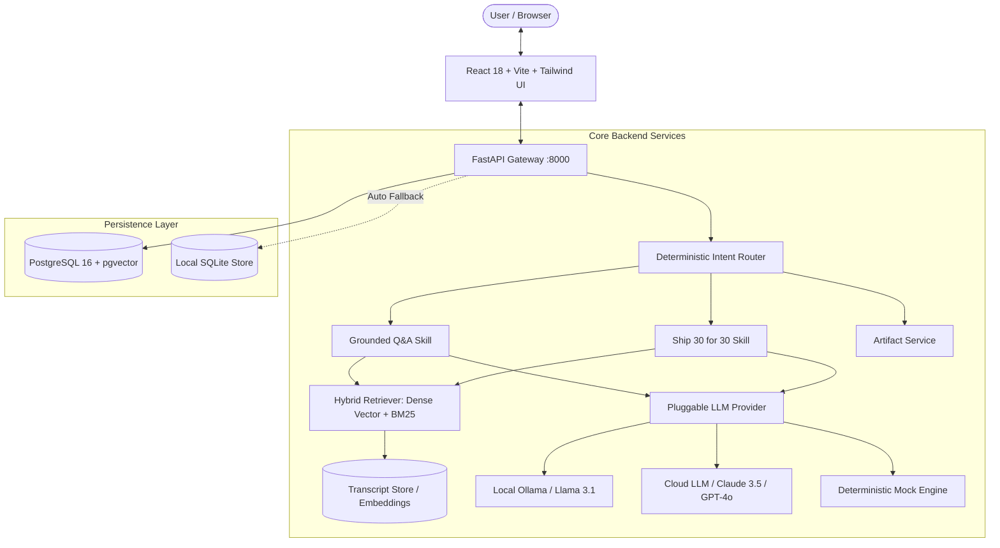

# The Lenny Growth Assistant

<p align="center">
  
  
  
  
  
  
  
  
</p>

> **The Lenny Growth Assistant** is an enterprise-grade conversational AI platform designed to transform *Lenny's Podcast* transcripts into actionable product and growth wisdom. It features verifiable citation grounding, Ship 30 for 30 essay generation, sandboxed interactive artifacts, and resilient multi-provider LLM support.

---

## Table of Contents
1. [Core Capabilities](#core-capabilities)
2. [Architecture Overview](#architecture-overview)
3. [System Documentation & Specifications](#system-documentation--specifications)
4. [Quick Start Guide](#quick-start-guide)
   - [Option A: Full-Stack Docker Compose (Recommended)](#option-a-full-stack-docker-compose-recommended)
   - [Option B: Local Host Setup](#option-b-local-host-setup)
5. [LLM Provider Configuration](#llm-provider-configuration)
6. [Interactive Artifact Studio & Security](#interactive-artifact-studio--security)
7. [API Documentation & Examples](#api-documentation--examples)
8. [Testing & Quality Assurance](#testing--quality-assurance)
9. [Project Structure](#project-structure)
10. [Verification Checklist](#verification-checklist)

---

## Core Capabilities

* **Verifiable Grounded Q&A (RAG):** Answers queries strictly based on indexed podcast transcripts from world-class product leaders (e.g., Rahul Vohra, Brian Chesky, Elena Verna, Shreyas Doshi, Sean Ellis, April Dunford, Gokul Rajaram). Every claim links to guest name, episode title, and timestamped excerpt.
* **Knowledge Boundary Guardrails:** Deliberately avoids ungrounded hallucinations by evaluating retrieval relevance against strict similarity thresholds and returning explicit, helpful boundary refusals for out-of-scope queries.
* **Ship 30 for 30 Editorial Skill:** Synthesizes ~1,250-word, high-density, highly-skimmable essays following the Ship 30 methodology (compelling hook, narrative tension, 3 actionable pillars, and implementation checklists).
* **Interactive Sandboxed Artifact Studio:** Dynamically renders generated Markdown frameworks and interactive HTML/JS calculators (e.g., PMF engines, LTV/CAC calculators, SPADE decision matrices) in an isolated, triple-layer secured iframe sandbox.
* **Resilient Dual-Persistence:** Seamlessly connects to PostgreSQL 16 + pgvector in production/Docker, with an automatic, zero-configuration local SQLite fallback for immediate host development.

---

## Architecture Overview



---

## System Documentation & Specifications

| Component / Focus Area | Description | Document |
| :--- | :--- | :---: |
| **Product Requirements** | Jobs-to-be-Done (JTBD), user stories, acceptance criteria, and edge cases | [`PRD.md`](./PRD.md) |
| **System Architecture** | Component topology, data pipelines, API contracts, and security boundaries | [`architecture.md`](./architecture.md) |
| **UI/UX Design System** | Information architecture, typography, color palette, and interaction flows | [`design.md`](./design.md) |
| **Knowledge Base & RAG** | Transcript ingestion, text chunking, and hybrid retrieval engine | [`docs/knowledge-base.md`](./docs/knowledge-base.md) |
| **Persistence Layer** | PostgreSQL schemas, pgvector indexing, and SQLite fallback mechanics | [`docs/database.md`](./docs/database.md) |
| **Conversational Agent** | Intent classification, system prompts, and multi-turn context management | [`backend/app/services/agent_service.py`](./backend/app/services/agent_service.py) |
| **Ship 30 for 30 Skill** | Essay formatting, editorial guidelines, and synthesis prompts | [`docs/ship30.md`](./docs/ship30.md) |
| **Artifact Studio & Sandbox** | Multi-layer HTML AST sanitization, CSP rules, and iframe isolation | [`docs/artifacts.md`](./docs/artifacts.md) |
| **LLM Provider Gateway** | Multi-provider client adapters, timeout handlers, and failover logic | [`docs/providers.md`](./docs/providers.md) |
| **Verification & Demo Script** | Step-by-step evaluation guide covering all operational requirements | [`docs/demo-script.md`](./docs/demo-script.md) |

---

## Quick Start Guide

### Option A: Full-Stack Docker Compose (Recommended)

Run the entire platform (PostgreSQL with `pgvector`, FastAPI backend, and React frontend) with a single command:

```bash
docker compose up --build
```

* **Frontend Application:** [http://localhost:3000](http://localhost:3000)
* **Backend API Swagger Docs:** [http://localhost:8000/docs](http://localhost:8000/docs)
* **Health Check:** [http://localhost:8000/health](http://localhost:8000/health)

---

### Option B: Local Host Setup

#### 1. Backend Setup
```bash
cd backend
python -m venv .venv
# On Windows: .venv\Scripts\activate | On Linux/macOS: source .venv/bin/activate
pip install -r requirements.txt

# Run FastAPI server (uses local SQLite automatically if PostgreSQL is not active)
python -m uvicorn app.main:app --host 0.0.0.0 --port 8000 --reload
```

#### 2. Frontend Setup
```bash
cd frontend
npm install
npm run dev
```
Open **[http://localhost:3000](http://localhost:3000)** in your browser.

---

## LLM Provider Configuration

Configure `LLM_PROVIDER` in your `.env` file based on your environment:

### 1. Built-in Deterministic Mode (Default / Offline Demo)
Zero external API keys or background services needed. Runs immediately with verified grounding:
```env
LLM_PROVIDER=mock
```

### 2. Local Ollama Mode
Runs open-weight models locally on your GPU/CPU:
```env
LLM_PROVIDER=ollama
OLLAMA_BASE_URL=http://localhost:11434
OLLAMA_MODEL=llama3.1:8b
```
*(Make sure to run `ollama serve` and `ollama run llama3.1:8b`)*

### 3. Cloud Provider Mode (OpenAI / Anthropic)
```env
LLM_PROVIDER=cloud
CLOUD_PROVIDER=openai # or anthropic
OPENAI_API_KEY=sk-...
CLOUD_MODEL=gpt-4o
```

---

## Interactive Artifact Studio & Security

The assistant can generate standalone, interactive artifacts (Markdown documents, frameworks, and interactive HTML tools).

### Triple-Layer Security Architecture
1. **Server-Side AST Sanitization:** Python-based parser strips script injection vectors, dangerous URI schemes (`javascript:`, `vbscript:`), and window/storage exfiltration attempts (`document.cookie`, `localStorage`, `window.parent`).
2. **Injected Content Security Policy (CSP):** Enforces `default-src 'none'; style-src 'unsafe-inline'; script-src 'unsafe-inline'; img-src data: https:; font-src data: https:;`.
3. **Strict Iframe Sandbox Isolation:** Rendered in an `<iframe>` configured with `sandbox="allow-scripts"` (strictly omitting `allow-same-origin` and `allow-top-navigation`), isolating generated artifacts from host application memory and cookies.

---

## API Documentation & Examples

### 1. Health Check
```bash
curl http://localhost:8000/health
```
```json
{
  "status": "healthy",
  "service": "lenny-growth-assistant",
  "version": "1.0.0",
  "environment": "development",
  "llm_provider": "mock",
  "database_connected": true
}
```

### 2. Create Chat Session & Send Message
```bash
# Create Session
curl -X POST http://localhost:8000/api/v1/sessions \
  -H "Content-Type: application/json" \
  -d '{"title": "Product Market Fit Discussion"}'

# Send Message with Transcript Grounding
curl -X POST http://localhost:8000/api/v1/sessions/{session_id}/chat \
  -H "Content-Type: application/json" \
  -d '{"message": "How did Superhuman measure product market fit with Rahul Vohra?"}'
```

### 3. Generate Ship 30 for 30 Essay
```bash
curl -X POST http://localhost:8000/api/v1/sessions/{session_id}/ship30 \
  -H "Content-Type: application/json" \
  -d '{
    "topic": "Finding Product Market Fit",
    "audience": "Founders and Growth PMs",
    "angle": "Quantitative PMF engine vs intuition"
  }'
```

---

## Testing & Quality Assurance

The codebase includes an automated test suite covering unit schemas, intent routing, hybrid retrieval, persistence, provider failover, artifact security, and end-to-end integration workflows.

### Run Test Suite
```bash
cd backend
pytest -v
```
**Results:** `89 passed in 15.76s (100% pass rate)`

### Build Production Frontend
```bash
cd frontend
npm run build
```
**Results:** `0 errors, production bundle compiled to dist/`

---

## Project Structure

```text
lenny-growth-assistant/
├── PRD.md                     # Complete Product Requirements Document
├── architecture.md            # System Architecture & Technical Specifications
├── design.md                  # UI/UX Design System & Layout Guidelines
├── README.md                  # Master repository documentation
├── docker-compose.yml         # Multi-container production deployment
├── .env.example               # Environment variable templates
├── data/
│   ├── raw/                   # Cleaned podcast transcript JSON files
│   └── manifests/             # Ingestion manifest and metadata
├── docs/                      # Subsystem deep dives & demo walk-throughs
│   ├── knowledge-base.md      # Ingestion & Hybrid RAG details
│   ├── database.md            # PostgreSQL & SQLite persistence specs
│   ├── ship30.md              # Ship 30 for 30 skill prompt guidelines
│   ├── artifacts.md           # Artifact Studio & HTML security model
│   ├── providers.md           # LLM provider configuration & fallbacks
│   └── demo-script.md         # End-to-end evaluation & demo script
├── backend/
│   ├── app/
│   │   ├── api/v1/            # Versioned REST endpoints (sessions, chat, artifacts, health)
│   │   ├── core/              # Config, logging, security sanitizers, error handlers
│   │   ├── db/                # Async database engine, session dependencies, ORM Base
│   │   ├── models/            # SQLAlchemy schemas (Session, Message, Artifact, Episode, Chunk)
│   │   ├── schemas/           # Pydantic request/response & citation models
│   │   ├── agent/             # Intent router, system prompts, skills, LLM providers
│   │   ├── knowledge/         # Chunking, vector embeddings, and hybrid retriever
│   │   ├── services/          # Agent, session, and artifact business logic
│   │   └── main.py            # FastAPI application gateway & lifespan handlers
│   ├── tests/                 # Comprehensive test suite (89 tests)
│   ├── requirements.txt       # Pinned backend Python dependencies
│   └── Dockerfile             # Production container image
└── frontend/
    ├── src/
    │   ├── components/        # Sidebar, ChatMessage, ChatInput, ArtifactViewer, EmptyState
    │   ├── services/          # Type-safe API client wrappers
    │   ├── types/             # TypeScript interfaces
    │   ├── App.tsx            # Main responsive layout shell
    │   └── main.tsx           # React DOM root entrypoint
    ├── package.json           # Frontend dependencies & scripts
    ├── vite.config.ts         # Vite build tool and proxy configuration
    └── Dockerfile             # Nginx-based multi-stage container
```

---

## Verification Checklist

- [x] **Source Grounding:** Every factual answer links to real Lenny's Podcast transcripts with guest names and timestamps.
- [x] **Hallucination Prevention:** Explicit Knowledge Boundary Refusals triggered when similarity is below threshold.
- [x] **Ship 30 for 30 Skill:** Dedicated synthesis skill producing structured ~1,250-word editorial essays.
- [x] **Sandboxed Artifact Studio:** Interactive Markdown & HTML rendering isolated via CSP and iframe sandbox.
- [x] **Bimodal & Resilient:** Support for Local Ollama, Cloud LLMs, and zero-dependency Offline Mock.
- [x] **Containerized:** 1-command deployment via Docker Compose.
- [x] **Test Coverage:** 89 passing unit, integration, and security tests.

---

<p align="center">
  <b>The Lenny Growth Assistant — Built for Lenny's Podcast Knowledge Extraction & Growth Synthesis</b>
</p>
