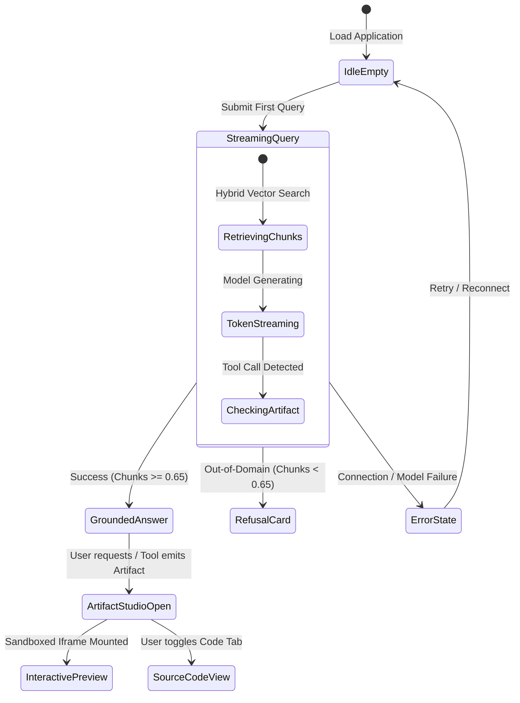

# The Lenny Growth Assistant — UI/UX Design Document

**Document Version:** 1.0.0  
**Status:** Design Baseline (Phase 2)  
**Author:** Senior Forward Deployed Engineer & Product Designer  
**Project:** The Lenny Growth Assistant  

---

## 1. Design Philosophy & Core Principles

The user interface of **The Lenny Growth Assistant** is designed around six foundational product design principles:

1. **Grounded & Verifiable:** The UI treats provenance as a first-class citizen. Every insight, framework, and quotation derived from the podcast transcripts must feature unambiguous, interactive source attribution badges that can be clicked to reveal the exact transcript context.
2. **Side-by-Side Spatial Coherence:** Working with generated artifacts (growth calculators, prioritization tables, atomic essays) requires dedicated visual space. The UI prevents vertical scrolling fatigue by employing a dual-pane workspace where conversational reasoning sits on the left and live artifacts sit on the right.
3. **Transparent Operational Status:** The user is always aware of the system's internal state—whether searching transcript embeddings, consulting specific podcast episodes, streaming tokens, or executing local vs. cloud inference.
4. **Resilient & Non-Deceptive:** If an inquiry cannot be answered with high confidence from the podcast corpus, the UI displays a clear, respectful refusal card suggesting valid adjacent topics rather than letting the user wonder if the response is fabricated.
5. **Zero-Latency Feel & Smooth Streaming:** Server-Sent Events (SSE) stream tokens continuously with fluid Markdown parsing, instantaneous syntax highlighting, and non-blocking background artifact compilation.
6. **Accessible & Keyboard-Friendly:** Full compliance with WCAG 2.1 AA standards, including high-contrast color palettes, screen-reader friendly ARIA attributes, and intuitive keyboard navigation shortcuts (`Ctrl+K` for new chat, `Esc` to close drawers).

---

## 2. Information Architecture (IA)

The application is structured into four primary interactive zones:

```
+----------------------------------------------------------------------------------------------------+
| [Logo] Lenny Growth Assistant               [Provider: Ollama (llama3.1:8b) v] [Settings] [Status] |
+----------------------+----------------------------------------------------+------------------------+
| CONVERSATION HISTORY | CHAT & GROUNDED REASONING WORKSPACE                | IN-APP ARTIFACT STUDIO |
|                      |                                                    |                        |
| [+ New Chat]         | [Session Title: Rahul Vohra on PMF]                | [Artifact: PMF Engine] |
|                      |                                                    |                        |
| - Superhuman PMF     | User:                                              | [Tabs: Preview | Code] |
| - Cold Start Loop    | How did Superhuman define their 40% PMF score?     |                        |
| - B2B Pricing        |                                                    | +--------------------+ |
| - Figma Bottom-up    | Assistant:                                         | | Interactive Widget | |
| - Retention Curves   | Rahul Vohra explained that if 40% of surveyed...   | | Target: 40%        | |
|                      |                                                    | | Disappointed: [46%]| |
|                      | Sources:                                           | | Result: PMF Achieved| |
|                      | [1] Ep 14: Rahul Vohra (00:14:20) [v]              | +--------------------+ |
|                      |                                                    |                        |
|                      | [Skill Pill: "Generate Ship 30 Essay"]             | [Copy] [Download] [x]  |
|                      | [Skill Pill: "Create PMF Calculator"]              |                        |
|                      |                                                    |                        |
|                      | [Message Input: Ask a follow-up...             ->] |                        |
+----------------------+----------------------------------------------------+------------------------+
```

### 2.1 Zone Breakdown
* **Left Sidebar (Session History & Navigation):** Collapsible panel managing past conversational threads, search across past sessions, and single-click new session creation.
* **Central Pane (Chat & Grounded Reasoning):** Real-time conversational stream, message bubbles, expandable source citation drawers, and quick-action skill suggestion chips.
* **Right Pane (In-App Artifact Studio):** Split-screen viewer that automatically slides open when artifacts are generated. Houses the sandboxed interactive `<iframe>`, Markdown renderer, raw code inspector, and export actions.
* **Top Header (System State & Configuration):** Displays application title, live model indicator (Ollama vs. Cloud), connection health badge, and configuration modal toggle.

---

## 3. Key User Interface States



### 3.1 State Specifications

#### State 1: Welcome & Empty State
* Clean, uncluttered layout with an introductory greeting.
* Curated **Prompt Starters** highlighting key podcast themes:
  * *"How did Superhuman measure product-market fit?"*
  * *"What are Lenny's top framework recommendations for B2B freemium pricing?"*
  * *"How do two-sided marketplaces solve the cold-start chicken-and-egg problem?"*

#### State 2: Active Streaming & Token Rendering
* Subtle animated pulse on the active message avatar.
* Smooth incremental token rendering without layout jitter.
* Interactive **"Stop Generating"** button positioned above the input bar.

#### State 3: Grounded Answer with Source Citation Badges
* Factual claims linked to compact source badges (e.g., `[Rahul Vohra • Ep #14]`).
* Clicking a badge expands a modal or drawer displaying:
  * Episode Title & Full Guest Name
  * Exact retrieved transcript excerpt with highlighted keywords
  * Original timestamp in the episode audio/video

#### State 4: Out-of-Domain Refusal State
* Soft amber informational card explaining that the query exceeds the podcast corpus boundary.
* Suggested related product/growth topics to redirect the user constructively.

#### State 5: In-App Artifact Studio (Split-Pane)
* Smooth CSS transition opening the right pane from $0\%$ to $45\%$ viewport width.
* Tabs: **Interactive Preview** (sandboxed `<iframe>` for HTML/JS, parsed view for Markdown) and **Source Code** (syntax-highlighted with line numbers).
* Header actions: Copy Raw Content, Download File (`.html` / `.md`), and Expand to Fullscreen.

#### State 6: Model Offline / Diagnostics Banner
* When Ollama is selected but unreachable, the top banner displays an amber warning: *"Local Ollama instance not detected at localhost:11434. Start Ollama or switch to Cloud in Settings."*

---

## 4. Responsive Layout & Split-Screen Behavior

| Breakpoint | Viewport Width | Layout Behavior |
| :--- | :--- | :--- |
| **Desktop / Wide** | $\ge 1440\text{px}$ | 3-Column Layout: Sidebar ($260\text{px}$), Chat ($45\%$), Artifact Studio ($55\%$). |
| **Standard Laptop** | $1024\text{px} - 1439\text{px}$ | 3-Column Layout: Collapsible Sidebar ($220\text{px}$), Chat ($50\%$), Artifact Studio ($50\%$). |
| **Tablet** | $768\text{px} - 1023\text{px}$ | 2-Column Layout: Drawer Sidebar, Chat/Artifact Studio toggleable via top tab bar. |
| **Mobile** | $< 768\text{px}$ | Single Column: Stacked view with bottom navigation bar between Chat, Sources, and Artifacts. |

---

## 5. Visual Design System & Tokens

* **Color Palette:**
  * Background Primary: `#0F172A` (Slate 900) / `#FFFFFF` (Light)
  * Background Secondary: `#1E293B` (Slate 800) / `#F8FAFC` (Slate 50)
  * Accent / Brand: `#6366F1` (Indigo 500) & `#8B5CF6` (Violet 500)
  * Success: `#10B981` (Emerald 500)
  * Warning / Refusal: `#F59E0B` (Amber 500)
  * Danger / Error: `#EF4444` (Red 500)
  * Text Primary: `#F8FAFC` / `#0F172A`
  * Text Muted: `#94A3B8` / `#64748B`
* **Typography:**
  * System Font Stack: `Inter, -apple-system, BlinkMacSystemFont, "Segoe UI", Roboto, sans-serif`
  * Monospace Font Stack (Code & Artifacts): `JetBrains Mono, "Fira Code", Consolas, monospace`

---

## 6. Accessibility & Usability Standards

* **Keyboard Navigation:**
  * `Ctrl + /` or `Cmd + /`: Focus message input.
  * `Ctrl + Shift + N` or `Cmd + Shift + N`: Create new conversation session.
  * `Esc`: Close open modal drawers, source inspectors, or popovers.
* **ARIA & Screen Readers:**
  * `aria-live="polite"` applied to streaming message container.
  * Explicit `aria-label` tags on all icon buttons (Copy, Download, Close, Send).
* **Color Contrast:** Minimum $4.5:1$ contrast ratio across all text elements against their respective backgrounds.

---
*End of UI/UX Design Document.*

