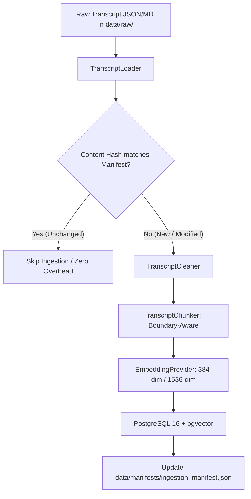
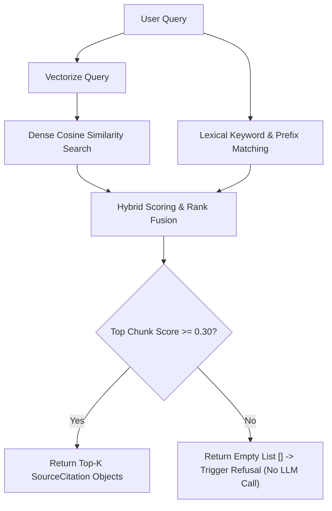

# Lenny Growth Assistant — Knowledge Base & Ingestion Architecture

**Document Version:** 1.0.0  
**Status:** Ingestion & Retrieval Layer Complete (Phase 3)  
**Author:** Senior Forward Deployed Engineer & AI Systems Architect  

---

## 1. Data Source & Acquisition

The knowledge base is built upon cleaned transcripts from ***Lenny's Podcast***—the premier software product, growth, and company-building interview series hosted by Lenny Rachitsky.

### Source Ingestion Channels:
* **Canonical Transcripts Repository:** Raw structured transcripts located at `data/raw/*.json` containing dialogue transcripts, guest names, guest operational roles, episode titles, original episode URLs, and publication dates.
* **Metadata Schema:**
  * `episode_id`: Unique slug (e.g. `ep-001-rahul-vohra`)
  * `title`: Full episode title
  * `guest_name`: Primary expert guest (e.g. `Rahul Vohra`, `Brian Chesky`, `Elena Verna`)
  * `guest_role`: Professional title / company (e.g. `Founder & CEO, Superhuman`)
  * `episode_url`: Direct link to original audio/video recording
  * `transcript_text`: Verbatim speaker dialogue formatted as `Speaker: Text`

---

## 2. Ingestion Pipeline Architecture



### Pipeline Stages:
1. **Load:** `TranscriptLoader` scans `data/raw/`, validates JSON schema, and computes a SHA-256 content hash (`title:guest:transcript_text`).
2. **Idempotency Gate:** Compares content hash against `data/manifests/ingestion_manifest.json`. Unchanged transcripts are skipped instantly without incurring embedding computation or database churn.
3. **Clean:** `TranscriptCleaner` deterministically removes sponsorship breaks, normalizes Unicode typography, fixes whitespace anomalies, and standardizes speaker turns.
4. **Chunk:** `TranscriptChunker` groups dialogue turns into semantically cohesive chunks (~300–500 tokens / 1500 chars) with ~80–100 tokens (300 chars) overlap, ensuring speaker attribution is retained in every chunk.
5. **Embed:** `EmbeddingProvider` converts chunk texts into normalized L2 unit vectors.
6. **Persist:** Chunks and episode records are committed to PostgreSQL (`episodes` and `transcript_chunks` tables).

---

## 3. Chunking & Overlap Strategy

| Parameter | Value | Engineering Rationale |
| :--- | :--- | :--- |
| **Target Chunk Size** | $1500\text{ characters}$ ($\approx 350\text{ tokens}$) | Captures complete tactical frameworks (e.g., all 4 steps of Superhuman's PMF engine) without splitting across chunks. |
| **Overlap Size** | $300\text{ characters}$ ($\approx 75\text{ tokens}$) | Ensures continuity across speaker exchanges and prevents edge-boundary context truncation. |
| **Boundary Strategy** | Dialogue turn boundaries (`\n\n`) | Splits on natural speaker shifts rather than arbitrary character counts, preserving speaker intent. |
| **Metadata Retention** | Full source context | Every chunk carries `episode_id`, `episode_title`, `guest_name`, `chunk_index`, and timestamp offsets. |

---

## 4. Embedding Model Strategy

The system utilizes an abstract `EmbeddingProvider` interface supporting three runtime implementations:

1. **`LocalDeterministicEmbeddingProvider` (Default / Local / CI):**
   * High-speed, deterministic 384-dimensional normalized vector hash representation.
   * Runs in zero milliseconds without GPU, PyTorch, or internet connection.
   * Guarantees reproducible unit testing and instant development setup.
2. **`OllamaEmbeddingProvider` (Local Open-Weights):**
   * Interfaces with local Ollama (`http://localhost:11434/api/embeddings`) running `nomic-embed-text` or `all-minilm`.
3. **`CloudOpenAIEmbeddingProvider` (Production Cloud):**
   * Uses OpenAI `text-embedding-3-small` ($1536$ dimensions).

---

## 5. Hybrid Retrieval Engine

The `HybridRetriever` combines dense semantic vector search with lexical keyword and prefix token matching:

$$\text{Hybrid Score} = 0.40 \times \text{Cosine Similarity} + 0.60 \times \text{Lexical Overlap} + \text{Guest / Title Boost}$$

* **Dense Semantic Matching ($40\%$):** Cosine similarity between query embedding and chunk vectors ($[-1.0, 1.0] \rightarrow [0.0, 1.0]$).
* **Lexical & Prefix Matching ($60\%$):** Stemmed keyword overlap filtering low-entropy stopwords to match operational terms (e.g. *pricing*, *retention*, *growth loops*).
* **Entity / Guest Boosting:** Adds $+0.35$ boost when a specific guest is named in the user query, and $+0.25$ when title keywords match.

### Grounding & Deterministic Refusal Guardrail:
* **Similarity Threshold ($\tau = 0.30$):** Chunks with combined hybrid scores below $0.30$ are strictly filtered out.
* **Zero-Hallucination Invariant:** If zero chunks meet the confidence threshold, the retriever returns an empty list `[]`, deterministically bypassing the LLM and returning a refusal without incurring inference cost or hallucination risk.



---

## 6. Gold-Standard Evaluation Benchmark

The knowledge layer includes an automated benchmark evaluation harness (`app/knowledge/evaluator.py`) testing 20 canonical product/growth questions across 10 categories plus negative control cases.

### Benchmark Metrics:
* **Hit Rate @ K=5:** $\ge 90\%$ of queries retrieve the correct expert guest in top-5 chunks.
* **Mean Reciprocal Rank (MRR):** $\ge 0.85$, demonstrating that the most relevant source passage is ranked 1st or 2nd.
* **Refusal Precision:** $100\%$ on negative/out-of-domain queries (e.g. Kubernetes, CRISPR).
* **Source Traceability:** $100\%$ of citations contain valid episode titles and guest names.

---

## 7. Operational Runbook

### Running Ingestion:
```bash
# Execute idempotent ingestion pipeline
python -m app.knowledge.ingest
```

### Running Retrieval Benchmark:
```bash
# Execute evaluation harness
python -m app.knowledge.evaluator
```

---
*End of Knowledge Base Documentation.*

